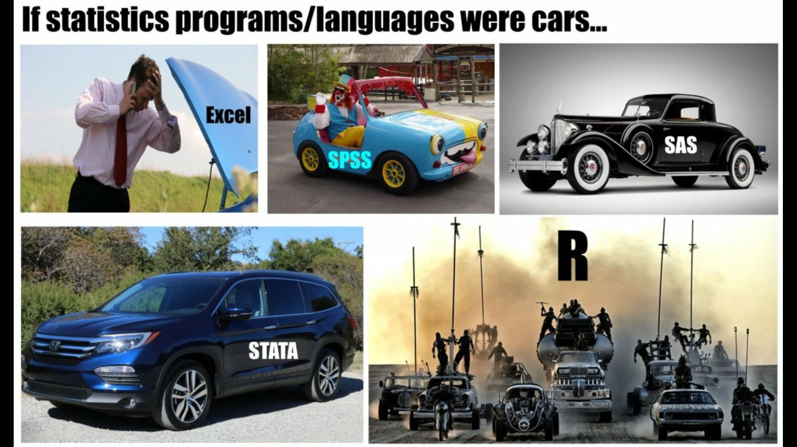

<style>
.small-code pre code {
  font-size: 1em;
}
</style>


  
QSURE R Training 2021: Lesson 1
========================================================
author: Karissa Whiting, Mike Curry
date: 2021-06-09
autosize: true

Training Agenda
========================================================

- **Lesson 1** – 6/9/2021
    - Intro to R and data types
    - Intro to tidyverse  
- **Lesson 2** - 6/10/2021
    - R Markdown
    - Plotting
    - Making tables/summarizing results
- **Lesson 3?** - TBD
    - Project organization/reproducibility
    - Coding case study
    - Github

<br>
* After lessons, reach out to Mike and I anytime on teams/email if you have questions!


R, Rstudio, Open source philosophy
========================================================

- **R** is an object-oriented **open-source** programming language used mostly for statistical computing and graphics

- **Open source** means the original source code is freely available, and can be distributed and modified. Also, users can contribute to the usefulness by creating packages, which implement specialized functions for all kinds of uses (e.g. statistical methods, graphical capabilities, reporting tools). 
Added Bonus: vibrant R community!

- **RStudio** is an integrated development environment (IDE) for R. It includes a console, syntax-highlighting code editor that supports direct code execution, as well as tools for plotting, history, debugging and work space management.


====================================

<center>

</center>

R Basics: General Things
========================================================

- `<-` is the assignment operator (`=` also works)


```r
v1 <- c(1, 2, 3)
v1
```

```
[1] 1 2 3
```

- `?` is your friend if you want to look at documentation! (e.g. type `?mean()` in the console)

- R is case sensitive, bE cArEfUl!


R Basics: Data Structures and Basic Syntax
========================================================

R basic data types: 

* Logical (`TRUE`)
* integer (`1`)
* numeric (a.k.a. double) (`1.2`)
* character (`"Purple"`)
* factor ("a")
* complex (nobody ever uses these really)


R Basics: Data Structures and Basic Syntax
========================================================

R has 5 basic data structures: 

1. vector
2. matrix
3. list
4. array
5. data.frame

R Basics: Data Structures and Basic Syntax
========================================================

- vector - only 1 data type allowed


```r
# character
c("apple", "orange")
```

```
[1] "apple"  "orange"
```

```r
# numeric
c(1:20)
```

```
 [1]  1  2  3  4  5  6  7  8  9 10 11 12 13 14 15 16 17 18 19 20
```

R Basics: Data Structures and Basic Syntax
========================================================

- matrix - 2d, only 1 data type allowed


```r
letters <- c("a","b","c","d", "e", "f")
matrix(letters, nrow=2, ncol=3)
```

```
     [,1] [,2] [,3]
[1,] "a"  "c"  "e" 
[2,] "b"  "d"  "f" 
```

R Basics: Data Structures and Basic Syntax
========================================================

- list - any data type allowed


```r
my_list <- list("a", 2, TRUE) 
str(my_list)
```

```
List of 3
 $ : chr "a"
 $ : num 2
 $ : logi TRUE
```

R Basics: Data Structures and Basic Syntax
========================================================
class: small-code

- arrays - n-dimensions, of 1 data type


```r
# Create two vectors of different lengths.
vector1 <- c(5,9,3)
vector2 <- c(10,11,12,13,14,15)

array(c(vector1,vector2),dim = c(3,3,2))
```

```
, , 1

     [,1] [,2] [,3]
[1,]    5   10   13
[2,]    9   11   14
[3,]    3   12   15

, , 2

     [,1] [,2] [,3]
[1,]    5   10   13
[2,]    9   11   14
[3,]    3   12   15
```


R Basics: Data Structures and Basic Syntax
========================================================
class: small-code

5. Data frames (or tibbles)
    - any data type is allowed, but each column has to have the same type
    - the most important for data analysts. Most similar to an excel spreadsheet/statistical data file


```r
head(iris, 4)
```

```
  Sepal.Length Sepal.Width Petal.Length Petal.Width Species
1          5.1         3.5          1.4         0.2  setosa
2          4.9         3.0          1.4         0.2  setosa
3          4.7         3.2          1.3         0.2  setosa
4          4.6         3.1          1.5         0.2  setosa
```


R Basics: Beware Data Type Coercion
========================================================
class: small-code

- Since columns of a data.frame must be of the same type, some data may be coerced in unexpected ways when reading in a csv or excel file. 

- character is often the default for mixed data types


```r
x <- c("apple", 3)
str(x)
```

```
 chr [1:2] "apple" "3"
```


```r
y <- c(3, 2, "twenty") 
y
```

```
[1] "3"      "2"      "twenty"
```


```r
#sum(y)
```


Exploring Your Data: Read in Your Data
========================================================
class: small-code

- The first step in a project is usually to read in your data into your Rstudio environment

- The {readr} and {readxl} packages (part of the tidyverse) have functions that read in excel and csv files with sensible defaults


```r
# check out the documentation with 
?readr::read_csv

readr::read_csv()
readxl::read_excel(
  path = "Users/Whiting/raw-data/mydataset_4-3-19.xlsx", 
  na = c(" ", "NA", "N/A", "NULL"))
```

Exploring Your Data: Identify Data Types
========================================================

- `colnames()` - will give you the column names
- `ncol()` and `nrow()` - will give you the total count of columns and rows respectively
- `class()`, `str()`, `attributes()` will give you meta-information on the object 
- `head()`, `tail()` show the top or bottom rows of your df
- `View()` will show the whole dataframe 
- `table()` will summarise variables


Exploring Your Data: Identify Data Types
========================================================
class: small-code


```r
str(iris)
```

```
'data.frame':	150 obs. of  5 variables:
 $ Sepal.Length: num  5.1 4.9 4.7 4.6 5 5.4 4.6 5 4.4 4.9 ...
 $ Sepal.Width : num  3.5 3 3.2 3.1 3.6 3.9 3.4 3.4 2.9 3.1 ...
 $ Petal.Length: num  1.4 1.4 1.3 1.5 1.4 1.7 1.4 1.5 1.4 1.5 ...
 $ Petal.Width : num  0.2 0.2 0.2 0.2 0.2 0.4 0.3 0.2 0.2 0.1 ...
 $ Species     : Factor w/ 3 levels "setosa","versicolor",..: 1 1 1 1 1 1 1 1 1 1 ...
```

```r
nrow(iris)
```

```
[1] 150
```

```r
colnames(iris)
```

```
[1] "Sepal.Length" "Sepal.Width"  "Petal.Length" "Petal.Width"  "Species"     
```

Exploring Your Data: Identify Data Types
========================================================
class: small-code


```r
class(iris)
```

```
[1] "data.frame"
```

```r
head(iris, 4)
```

```
  Sepal.Length Sepal.Width Petal.Length Petal.Width Species
1          5.1         3.5          1.4         0.2  setosa
2          4.9         3.0          1.4         0.2  setosa
3          4.7         3.2          1.3         0.2  setosa
4          4.6         3.1          1.5         0.2  setosa
```

```r
table(iris$Species)
```

```

    setosa versicolor  virginica 
        50         50         50 
```


Intro to tidyverse
========================================================

The tidyverse package is a collection of R packages designed for data analysis, all of which share a similar design, grammar, and structure.


```r
# load it
library(tidyverse)

# check out the cute logo
tidyverse_logo()
```

```
⬢ __  _    __   .    ⬡           ⬢  . 
 / /_(_)__/ /_ ___  _____ _______ ___ 
/ __/ / _  / // / |/ / -_) __(_-</ -_)
\__/_/\_,_/\_, /|___/\__/_/ /___/\__/ 
     ⬢  . /___/      ⬡      .       ⬢ 
```

Intro to tidyverse
========================================================

- readr: data import/export
- tibble: re-imagined data frames
- dplyr: data manipulation
- tidyr: data manipulation
- ggplot2: graphics and visualization
- purrr: functional programming toolkit, replaces the need for many loops
- stringr: string manipulation
- forcats: re-imagined factor data types

There are several additional packages which are installed as part of the tidyverse, but are not loaded by default.

Intro to tidyverse
========================================================

Overall tidyverse helps with code readability and has shortcuts for some common data manipulation tasks

tidyverse has been developed and significantly improved in the last few years, with a lot of ongoing work being done to further increase usability.

tidyverse: data cleaning with dplyr 
========================================================

The dplyr package is a data manipulation and cleaning package. A few of the key functions (verbs) in dplyr are:

- select()
- mutate()
- filter()
- arrange()
- group_by()
- summarize()

All take a data frame as input, and return a data frame as output.

Quick Aside: The Pipe Operator (%>%)
========================================================
class: small-code

- The pipe (%>%) is included as part of the magrittr package and facilitates passing arguments from one function to another

- The pipe operator takes the information on the left hand side, and provides it as the first argument to the right hand side


```r
vals <- c(1:4)
vals
```

```
[1] 1 2 3 4
```

```r
# no pipe
round(sqrt(sum(vals)), 3)
```

```
[1] 3.162
```

Quick Aside: The Pipe Operator (%>%)
========================================================
class: small-code


```r
library(magrittr)

# pipe
vals %>%
  sum() %>%
  sqrt() %>%
  round(3)
```

```
[1] 3.162
```

tidyverse: data cleaning with dplyr 
========================================================
class: small-code

- mpg example data


```r
nrow(mpg)
```

```
[1] 234
```

```r
str(mpg)
```

```
tibble [234 × 11] (S3: tbl_df/tbl/data.frame)
 $ manufacturer: chr [1:234] "audi" "audi" "audi" "audi" ...
 $ model       : chr [1:234] "a4" "a4" "a4" "a4" ...
 $ displ       : num [1:234] 1.8 1.8 2 2 2.8 2.8 3.1 1.8 1.8 2 ...
 $ year        : int [1:234] 1999 1999 2008 2008 1999 1999 2008 1999 1999 2008 ...
 $ cyl         : int [1:234] 4 4 4 4 6 6 6 4 4 4 ...
 $ trans       : chr [1:234] "auto(l5)" "manual(m5)" "manual(m6)" "auto(av)" ...
 $ drv         : chr [1:234] "f" "f" "f" "f" ...
 $ cty         : int [1:234] 18 21 20 21 16 18 18 18 16 20 ...
 $ hwy         : int [1:234] 29 29 31 30 26 26 27 26 25 28 ...
 $ fl          : chr [1:234] "p" "p" "p" "p" ...
 $ class       : chr [1:234] "compact" "compact" "compact" "compact" ...
```

tidyverse: data cleaning with dplyr 
========================================================
class: small-code

- select only model, displ, hwy columns


```r
new <- mpg %>%
  select(model, displ, hwy)

head(new, 4)
```

```
# A tibble: 4 x 3
  model displ   hwy
  <chr> <dbl> <int>
1 a4      1.8    29
2 a4      1.8    29
3 a4      2      31
4 a4      2      30
```


tidyverse: data cleaning with dplyr 
========================================================
class: small-code

- select only model, displ, hwy columns
- get column that is square root of displ


```r
new <- mpg %>%
  select(model, displ, hwy) %>%
  mutate(
    # make new squared variable
    displ_sqrd = displ^2,
  )

head(new, 4)
```

```
# A tibble: 4 x 4
  model displ   hwy displ_sqrd
  <chr> <dbl> <int>      <dbl>
1 a4      1.8    29       3.24
2 a4      1.8    29       3.24
3 a4      2      31       4   
4 a4      2      30       4   
```


tidyverse: data cleaning with dplyr 
========================================================
class: small-code

- select only model, displ, hwyl columns
- get column that is square root of displ
- filter those who have hwy < 14
- arrange by desc hwy


```r
new <- mpg %>%
  select(model, displ, hwy) %>%
  mutate(
    # make new squared variable
    displ_sqrd = displ^2,
  ) %>%
  filter(hwy < 14) %>%
  arrange(desc(hwy))

head(new, 4)
```

```
# A tibble: 4 x 4
  model               displ   hwy displ_sqrd
  <chr>               <dbl> <int>      <dbl>
1 dakota pickup 4wd     4.7    12       22.1
2 durango 4wd           4.7    12       22.1
3 ram 1500 pickup 4wd   4.7    12       22.1
4 ram 1500 pickup 4wd   4.7    12       22.1
```

tidyverse: data cleaning with dplyr 
========================================================
class: small-code

- `group_by()` and `summarise()`


```r
mpg %>%
  group_by(year) %>%
  summarize(
    count = n(),
    distinct = n_distinct(manufacturer, cyl),
    avg_cty = mean(cty),
    max_hwy = max(hwy)
  )
```

```
# A tibble: 2 x 5
   year count distinct avg_cty max_hwy
  <int> <int>    <int>   <dbl>   <int>
1  1999   117       28    17.0      44
2  2008   117       31    16.7      37
```

tidyverse: joining data sets with dplyr 
========================================================

<center>

</center>


Resources
========================================================

- These materials will be posted to teams
- Data wrangling cheat sheet: https://www.rstudio.com/wp-content/uploads/2015/02/data-wrangling-cheatsheet.pdf
- Questions? Reach out to myself or Mike on teams
- Create an R help channel on teams

Exercises
========================================================

1. Check out the structure of the `iris` dataset. How many numeric columns does it have?
2. Make a `table()` of the Species column. How many of each flower type are there?
3. Group the data frame by Species then summarise to find the mean of Sepal.Length. What is the mean Sepal.Length of versicolor?
4. Make a new column called "new_col" that is Sepal.Length/ Sepal.Width (use `mutate()`)

Answers to Exercises
========================================================
class: small-code

1. Check out the structure of the `iris` dataset. How many numeric columns does it have?

There are 4 numeric columns


```r
str(iris)
```

```
'data.frame':	150 obs. of  5 variables:
 $ Sepal.Length: num  5.1 4.9 4.7 4.6 5 5.4 4.6 5 4.4 4.9 ...
 $ Sepal.Width : num  3.5 3 3.2 3.1 3.6 3.9 3.4 3.4 2.9 3.1 ...
 $ Petal.Length: num  1.4 1.4 1.3 1.5 1.4 1.7 1.4 1.5 1.4 1.5 ...
 $ Petal.Width : num  0.2 0.2 0.2 0.2 0.2 0.4 0.3 0.2 0.2 0.1 ...
 $ Species     : Factor w/ 3 levels "setosa","versicolor",..: 1 1 1 1 1 1 1 1 1 1 ...
```

Answers to Exercises
========================================================
class: small-code

2. Make a `table()` of the Species column. How many of each flower type are there?


```r
table(iris$Species)
```

```

    setosa versicolor  virginica 
        50         50         50 
```

another "tidyverse" style option:


```r
iris %>%
  select(Species) %>%
  table()
```

```
.
    setosa versicolor  virginica 
        50         50         50 
```

Answers to Exercises
========================================================
class: small-code

a 3rd option


```r
iris %>%
  group_by(Species) %>%
  count()
```

```
# A tibble: 3 x 2
# Groups:   Species [3]
  Species        n
  <fct>      <int>
1 setosa        50
2 versicolor    50
3 virginica     50
```

a FOURTH option!


```r
iris %>%
  group_by(Species) %>%
  summarise(n = n())
```

```
# A tibble: 3 x 2
  Species        n
  <fct>      <int>
1 setosa        50
2 versicolor    50
3 virginica     50
```

Answers to Exercises
========================================================
class: small-code

3. Group the data frame by Species then summarise to find the mean of Sepal.Length. What is the mean Sepal.Length of versicolor?

The mean Sepal Length of versicolor is  5.94


```r
iris %>% 
  group_by(Species) %>%
  summarise(mean_sepal_length = mean(Sepal.Length))
```

```
# A tibble: 3 x 2
  Species    mean_sepal_length
  <fct>                  <dbl>
1 setosa                  5.01
2 versicolor              5.94
3 virginica               6.59
```

Answers to Exercises
========================================================
class: small-code

4. Make a new column called "new_col" that is Sepal.Length/ Sepal.Width (use `mutate()`)


```r
x <- iris %>% 
  mutate(new_col = Sepal.Length/ Sepal.Width)

# just showing first 5 observations
head(x, n = 5)
```

```
  Sepal.Length Sepal.Width Petal.Length Petal.Width Species  new_col
1          5.1         3.5          1.4         0.2  setosa 1.457143
2          4.9         3.0          1.4         0.2  setosa 1.633333
3          4.7         3.2          1.3         0.2  setosa 1.468750
4          4.6         3.1          1.5         0.2  setosa 1.483871
5          5.0         3.6          1.4         0.2  setosa 1.388889
```

Thanks!
========================================================

Questions?

